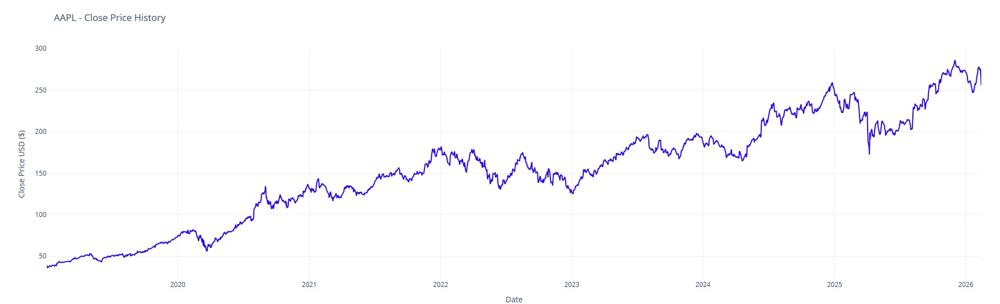
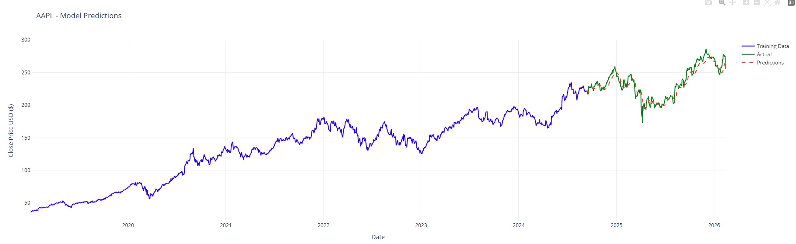
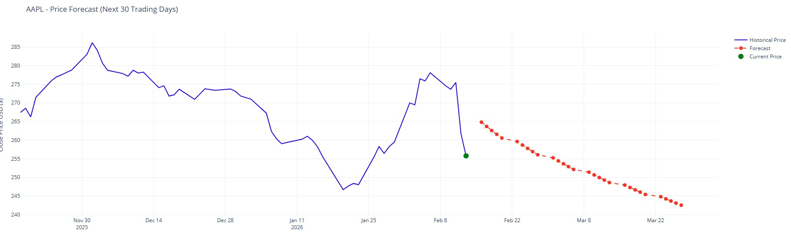

# PyStock


Interactive stock price prediction using LSTM neural networks and TensorFlow.

**⚠️ DISCLAIMER:** This is an educational project and **NOT a financial tool or investment advice.** See [disclaimer](#disclaimer) below.

## Features

- **LSTM Neural Network**: Deep learning architecture for time-series forecasting
- **Yahoo Finance Integration**: Automatic historical data retrieval
- **Data Visualization**: Plots historical prices and prediction comparisons
- **Reproducible Results**: Deterministic predictions with seed management
- **Multi-Day Forecasting**: Predict up to any number of days into the future

## Prerequisites

- **Python 3.8** or higher
- **pip** (Python package manager)
- **Internet connection** (to fetch stock data from Yahoo Finance)
- **4GB RAM** minimum (GPU optional, CPU works fine)

## Installation

### From source

Clone the repository and install in development mode:

```bash
git clone https://github.com/eddinho/pystock.git
cd pystock
pip install -e .
```

## Quick Start

### Generate predictions

```bash
# Predict next trading day
pystock AAPL

# Predict next 30 trading days
pystock AAPL --days 30

# Predict any number of days ahead
pystock AAPL --days 10

# Test with demo data (no Yahoo Finance needed)
pystock AAPL --demo --days 30

# Force a fresh model (ignore saved weights)
pystock AAPL --fresh-model
```

### Examples

```bash
pystock MSFT
pystock TSLA
pystock ^GSPC  # S&P 500
pystock AAPL --days 30  # 30-day forecast
pystock AAPL --demo --days 30  # Demo mode with generated data
```

## Output

The tool will:

1. Fetch historical stock data from Yahoo Finance (since 2019)
2. Display raw data preview
3. Generate and save historical closing price chart as `prediction/pystock_history_<TICKER>.html`
4. Train LSTM model (80% training, 20% testing)
5. Display prediction accuracy (RMSE)
6. Generate and save validation chart as `prediction/pystock_validation_<TICKER>.html`
7. Predict next trading day's closing price (or multiple days if `--days` is specified)
8. For multi-day forecasts, generate and save forecast chart as `prediction/pystock_forecast_<TICKER>.html`
9. Save model as `pystock_<TICKER>.h5`
10. On next run, load `pystock_<TICKER>.h5` and continue training (unless `--fresh-model` is used)

### Output Examples

**Historical Price Data:**


**Model Validation (Training vs Actual vs Predictions):**


**30-Day Price Forecast:**


### Output Files

**HTML Charts** (saved in `prediction/` folder):
- All HTML files are interactive and can be opened in any web browser
- The `prediction/` folder is automatically created and is **not tracked by git** (see `.gitignore`)
- Charts can be zoomed, panned, and exported directly from the browser

**Model** (saved in root directory):
- `pystock_<TICKER>.h5` - Trained neural network model (AI generated, not tracked by git)
- Non-alphanumeric ticker characters are converted to underscores in filenames (e.g., `BRK-B` -> `BRK_B`)

All charts are generated as interactive HTML files in the `prediction/` folder that you can open in your browser.

### Multi-Day Forecasting

When using `--days N`, the tool will:
- Generate predictions for the next N trading days
- Display each day's predicted price with price change and percentage change
- Show total change over the forecast period
- Generate an interactive forecast chart showing 60 days of historical data plus the N-day forecast
- Save the forecast chart as `prediction/pystock_forecast_<TICKER>.html`

### Demo Mode

Use the `--demo` flag to test the tool without requiring Yahoo Finance API access:

```bash
pystock AAPL --demo --days 30
```

Demo mode generates realistic synthetic stock data, allowing you to:
- Test the entire prediction pipeline
- See chart generation without API connectivity issues
- Validate the forecasting visualization before running with real data

## Model Architecture

```
Input (60-day lookback)
    ↓
LSTM (50 units, return sequences)
    ↓
LSTM (50 units)
    ↓
Dense (25 neurons)
    ↓
Output (predicted price)
```

## Configuration

Edit parameters in `src/pystock/main.py`:

```python
LOOKBACK_DAYS = 60       # Historical days to analyze
TRAIN_TEST_SPLIT = 0.8   # 80/20 split
BATCH_SIZE = 1           # Training batch size
EPOCHS = 1               # Training iterations
```

## Project Structure

```
pystock/
├── src/
│   └── pystock/
│       ├── __init__.py              # Package initialization
│       └── main.py                  # Core prediction logic
├── prediction/                      # Generated charts and analysis (auto-created)
│   ├── pystock_history_<TICKER>.html      # Historical price chart
│   ├── pystock_validation_<TICKER>.html   # Model validation chart
│   └── pystock_forecast_<TICKER>.html     # Price forecast chart (if using --days)
├── doc/
│   ├── CONTRIBUTING.md              # Contribution guidelines
│   ├── DEVELOPMENT.md               # Developer documentation
│   ├── CHANGELOG.md                 # Version history
│   └── PUBLICATION_CHECKLIST.md     # Pre-publication requirements
├── pyproject.toml                   # Modern packaging configuration
├── README.md                        # This file
├── LICENSE                          # MIT License
├── .gitignore                       # Git ignore rules
└── requirements.txt                 # Project dependencies
```

## Dependencies

- **tensorflow** (≥2.10.0): Deep learning framework
- **keras** (≥2.10.0): Neural network API
- **pandas** (≥1.3.0): Data manipulation
- **yfinance** (≥0.2.0): Yahoo Finance integration
- **scikit-learn** (≥1.0.0): ML utilities
- **numpy** (≥1.21.0): Numerical computing
- **matplotlib** (≥3.5.0): Data visualization
- **plotly** (≥5.0.0): Interactive HTML charts

Install all dependencies:

```bash
pip install -r requirements.txt
```

## Branching Strategy

This project uses a **Git flow** branching strategy to maintain code quality and enable collaborative development.

### Branch Structure

- **`main`** - Production-ready code. Stable releases only.
- **`dev`** - Development/staging branch where features integrate before production.
- **`feature/*`** - Feature branches for new functionality (created from `dev`).

### Contributor Workflow

Follow these steps to contribute:

1. **Create feature branch from dev**
   ```bash
   git checkout -b feature/your-feature origin/dev
   ```

2. **Make changes and commit**
   ```bash
   git add .
   git commit -m "Feature: clear description of changes"
   ```

3. **Push to your fork**
   ```bash
   git push -u origin feature/your-feature
   ```

4. **Create Pull Request to dev** (NOT main)
   - Set PR target to `dev` branch
   - Request review from maintainers
   - Address any feedback
   - Wait for approval before merging

5. **After approval, merge to dev**
   - PR is merged by maintainer
   - Feature is now in the staging/development branch

6. **Release to main when ready**
   - Maintainer creates PR from `dev` → `main`
   - Tests and reviews are performed
   - After merge to main, create release tag: `git tag -a v1.x.x`
   - This triggers a new production release

### Branch Protection Rules

**Protected branches:**
- **`main`**: Requires pull request review before merge. All contributors must use PRs.
- **`dev`**: Requires pull request review before merge.

⚠️ **Direct pushes to `main` or `dev` are blocked.** All changes must go through pull requests.

## Troubleshooting

### Module not found errors
```bash
pip install -r requirements.txt
```

### Invalid ticker symbol
- Verify the ticker is correct and traded on Yahoo Finance
- Check your internet connection
- Try a well-known symbol like AAPL or MSFT to test

### No data retrieved
- Yahoo Finance may have data limitations or temporary issues
- Try again in a few minutes
- Test your internet connection

### GPU/CUDA issues
For CPU-only TensorFlow (faster installation):
```bash
pip install tensorflow-cpu
```

### Model file location
- The trained model is saved as `pystock_<TICKER>.h5` in the current directory
- It's automatically ignored by git (see `.gitignore`)
- By default, the next run reuses this file and continues training
- Use `--fresh-model` to start from scratch and overwrite the saved model

### Out of memory errors
- Reduce `BATCH_SIZE` from 1 to smaller values
- Reduce `LOOKBACK_DAYS` from 60 to 30-45
- Reduce LSTM units from 50 to 25-30

## Disclaimer {#disclaimer}

### Legal Notice

**THIS SOFTWARE IS PROVIDED "AS IS" WITHOUT WARRANTY OF ANY KIND.**

### Educational Purpose Only

PyStock is an **educational project** designed to teach LSTM neural networks and time-series forecasting. It is **NOT**:
- A financial tool
- An investment advisor
- Financial advice
- A recommendation to buy or sell securities

### Risk Warning

⚠️ **Stock price predictions are inherently uncertain and should NEVER be used as the sole basis for investment decisions.** Factors affecting stock prices include:
- Market conditions and volatility
- Economic indicators
- Company announcements and earnings
- Geopolitical events
- Regulatory changes
- Model limitations and errors

Past performance does not guarantee future results.

### Liability

The authors and contributors are **not responsible** for any:
- Financial losses or gains
- Investment decisions based on this tool
- Damages or consequences arising from using this software
- Data accuracy or completeness from external sources

**Always consult qualified financial professionals before making investment decisions.**

## Documentation

- [Contributing Guide](doc/CONTRIBUTING.md) - How to contribute to the project
- [Development Guide](doc/DEVELOPMENT.md) - Architecture, setup, and debugging
- [Changelog](doc/CHANGELOG.md) - Version history and future roadmap
- [Publication Checklist](doc/PUBLICATION_CHECKLIST.md) - Pre-publication requirements

## Contributing

Contributions are welcome! Please see [CONTRIBUTING.md](doc/CONTRIBUTING.md) for guidelines.

### Ideas for Enhancement

- ~~Support multiple day forecasting~~ ✅ **Now available with `--days N`**
- Support multiple stock symbols comparison
- Add technical indicators (RSI, MACD, Bollinger Bands)
- Web interface with Flask/Django
- Hyperparameter optimization and tuning
- Ensemble methods (combining multiple models)
- Real-time predictions with websockets
- Portfolio analysis features
- More advanced architectures (GRU, Transformer)

## License

MIT License - See [LICENSE](LICENSE) file for details.

## Author

Created as an educational project in deep learning and time-series forecasting.

---

**Questions?** Open an issue on GitHub or check the [Development Guide](doc/DEVELOPMENT.md).


